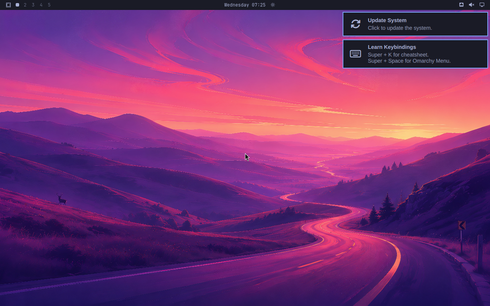

# omarchy-pi

Run [Omarchy](https://omarchy.org) — full experience, latest stable — on the Raspberry Pi 5.

> **Status: alpha.** Omarchy 4.0.2 builds and runs on aarch64 — the full
> desktop, from Omarchy's own installer, with zero failed install steps.
> Verified in a native aarch64 VM, on a Cortex-A76 model booting from emulated
> NVMe, and on QEMU's `raspi4b` as far as the Pi vendor kernel + SD boot chain
> goes; **not yet tested on real Pi 5 hardware** (V3D GPU, firmware, BCM2712).
> See [docs/PORTING.md](docs/PORTING.md).

*Omarchy 4 (Quattro) on aarch64, built by this repo and booted in QEMU.*

## Goal

A ready-to-flash SD card image (`.img.xz`, flashable with Raspberry Pi Imager) that boots a Pi 5 straight into Omarchy, tracking upstream stable releases with a minimal patch set — not a fork-distro.

## How it's structured

| Piece | What it is |
|---|---|
| **This repo** | Docs, image build tooling, Pi-specific configs, CI |
| [`vincenth19/omarchy`](https://github.com/vincenth19/omarchy) (`pi5` branch) | Fork of `basecamp/omarchy`: upstream stable tag + a few Pi/ARM patch commits, rebased on each upstream release |
| aarch64 packages | [pkgbuilds/](pkgbuilds/) plus rebuilds of 23 packages upstream ships x86_64-only. Currently baked into the image; hosting them as a public repo (so installed systems get updates) is the next milestone |

## What works today

Run `./scripts/build-all.sh` and you get a bootable aarch64 image with Omarchy
4.0.2 on it. Automated checks (`./scripts/smoke-test.sh`) confirm on every build:

- boots to `graphical.target` with **no failed systemd units**
- SDDM autologins into the Omarchy session; Hyprland and quickshell run
- 147 of 148 upstream packages installed (`herdr` is a build-memory issue, not ARM)
- pacman correctly configured for aarch64, with no x86 mirrors left behind

Getting there needed four source patches to Omarchy plus one additive drop-in —
all genuine ARM/Pi portability bugs, kept as a small series on the `pi5` branch and
[documented here](docs/PORTING.md#found-and-fixed-in-this-port).

## Approach

- Base: **Arch Linux ARM**, with `linux-rpi` on the Pi and the generic
  `linux-aarch64` kernel for the VM image
- Omarchy is installed as a **pacman package** (that is how Omarchy 4 ships),
  rebuilt for aarch64 from our `pi5` branch. Updates mean rebasing the patch
  series on the new upstream tag and rebuilding — see
  [the update workflow](docs/PORTING.md#update-workflow)
- Boot: Pi firmware boot on hardware, systemd-boot in the VM. Omarchy's
  Limine + btrfs-snapshot layer assumes PC-style UEFI and does not apply
- Images are built in native aarch64 containers on Apple Silicon — no emulation
- Prior ARM work that informed this: [ggalancs/omarchy-arm-utm](https://github.com/basecamp/omarchy/discussions/7956)

## Hardware target

- Raspberry Pi 5, 8 GB (4 GB untested)
- Official 5V/5A USB-C PSU, active cooler
- 32 GB+ microSD (A2-rated recommended) or NVMe HAT

## Prior art & credits

- [Omarchy](https://github.com/basecamp/omarchy) by DHH / Basecamp — the thing itself
- [omarchy-arm-utm](https://github.com/basecamp/omarchy/discussions/7956) — Omarchy 4 native aarch64 UTM build
- [omarchy-arm-fixes](https://github.com/happybigmtn/omarchy-arm-fixes) — ARM package/config fixes (Apple Silicon)
- [Pi 5 install guide (discussion #642)](https://github.com/basecamp/omarchy/discussions/642) — earlier Manjaro-based attempt; source of Pi-specific gotchas

## License

MIT — see [LICENSE](LICENSE). Omarchy itself is MIT-licensed by its authors.
