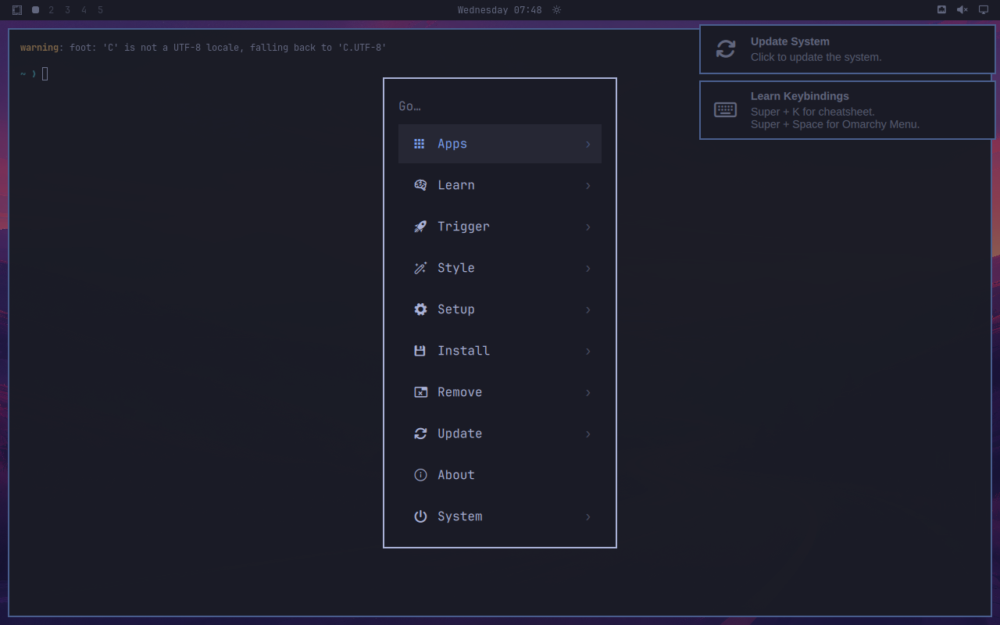
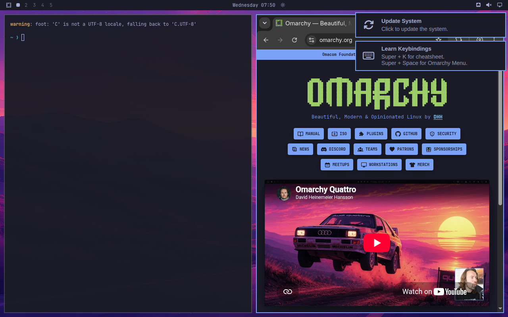
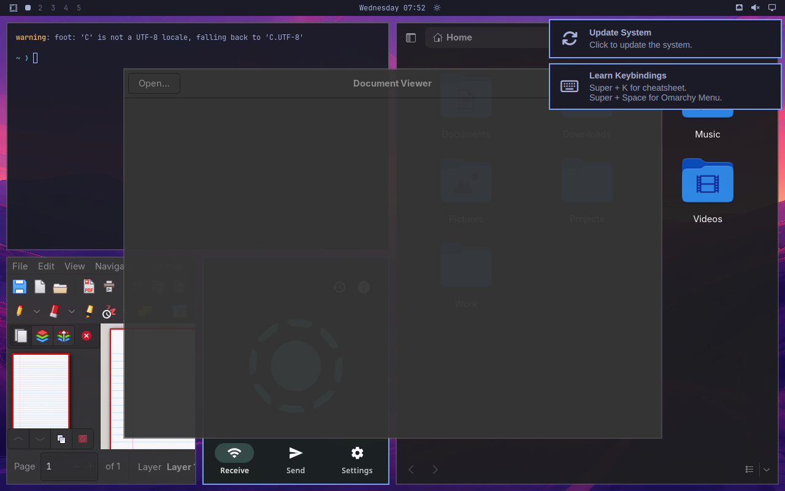
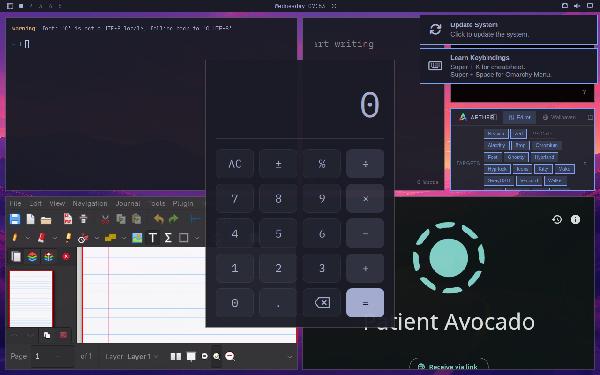
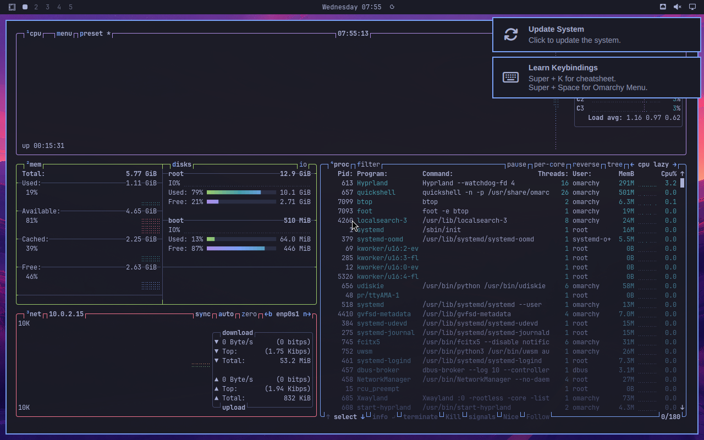
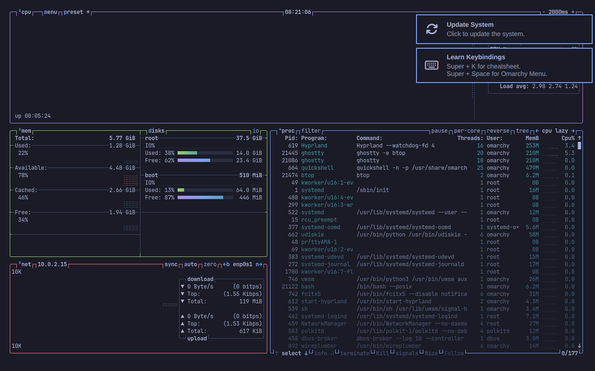

# Application testing

Every app was launched in the built aarch64 image and driven through the real
desktop (QEMU input injection + framebuffer capture), not just checked for a
running process. "Window" means Hyprland reported a mapped window; "renders"
means it was confirmed visually in a screenshot.

*Super+Space — the Omarchy menu, nerd-font icons intact.*

## Out-of-the-box, nothing installed

| App | Result |
|---|---|
| **foot** (default terminal) | Renders, themed, starship prompt |
| **Omarchy menu** (Super+Space) | Full menu, nerd-font icons correct |
| **hyprlock** | **Works** — blurred wallpaper, password unlock |
| **Chromium** | Works, dark theme, loaded omarchy.org over HTTPS with webfonts, images and embedded video |
| **Neovim** (LazyVim config) | Loads, 5/52 plugins in 34 ms |
| **btop** | Full render — CPU, memory, disk, network, process tree |
| **Nautilus** | Renders, icon theme correct |
| **Evince** | Renders |
| **Xournal++** | Renders, full toolbar |
| **LocalSend** | Renders |
| **omacalc** | Renders |
| **omawrite** | Renders |
| **omacut** | Window |
| **Aether** (theme editor) | Renders, target list populated |
| **cliamp** | Runs (TUI, no window — expected) |
| **Xwayland** | Running, so X11 apps are supported |

*Chromium on aarch64 with omarchy.org fully rendered.*

*Nautilus, Evince, Xournal++ and LocalSend tiled together.*

*omacalc, omawrite and Aether — Omarchy's own applications.*

*btop, showing the running session and 1.1 GB of 5.8 GB in use.*

No crashes. Idle memory use was **1.1 GB of 5.8 GB**, which leaves comfortable
headroom on an 8 GB Pi 5.

Two things the earlier Pi guides warned about did **not** reproduce:
`hyprlock` did not crash, and Chromium was not unstable.

## Installing extra software

`omarchy-pkg-add` is repository-only, and `yay` is available for the AUR.

| Package | Result |
|---|---|
| **Ghostty** | **Built and installed for aarch64.** Set as the default terminal via `omarchy install terminal ghostty`; Super+Return opens it with the active Omarchy theme |

*Ghostty 1.3.1 built for aarch64, running btop with Omarchy's theme.*

### What it took

Ghostty is not in Arch Linux ARM's repositories, but Arch's own package
declares `arch=(x86_64 aarch64 i686)`. Three fixes, none of them ARM code
problems — full recipe and a working PKGBUILD in
[pkgbuilds/ghostty/](../pkgbuilds/ghostty/):

1. **Zig version.** Ghostty 1.3.1 needs Zig 0.15.2; Arch Linux ARM ships
   0.16.0, which fails at comptime. The same mismatch is why AUR's
   `ghostty-git` (pinned `zig<0.16.0`) refuses to build. Zig publishes
   official aarch64 builds, so use 0.15.2 directly.
2. **pandoc.** `pandoc-cli` is x86_64-only and has no aarch64 build anywhere
   (Haskell toolchain). It is only used for man pages — but in `--system`
   mode Ghostty defaults `emit_docs` to true, so it must be turned off
   explicitly with `-Demit-docs=false`.
3. **A stale prefetch.** `fetch-zig-cache.sh` fetches `uucode-0.1.0` while
   `build.zig.zon` wants `0.2.0`; fetch and unpack the right one first.

## Caveats

This is a VM: no real GPU, so Hyprland runs on software rendering. Application
*correctness* transfers to the Pi; rendering performance and anything that
depends on the V3D driver does not.
